# Guida utente — OpenSagra

> Questa guida è per chi **scarica e usa le casse**: chi lavora al banco durante
> la sagra, e chi organizza/configura le postazioni prima che apra il servizio.
> Non richiede conoscenze tecniche — dove serve un termine più "da informatico"
> viene spiegato subito, in una frase.

## Indice

1. [Installazione](#1-installazione)
2. [Primo avvio: l'ID di questa cassa](#2-primo-avvio-lid-di-questa-cassa)
3. [La modalità Indipendente](#3-la-modalità-indipendente)
4. [Gestione Prodotti: catalogo e magazzino](#4-gestione-prodotti-catalogo-e-magazzino)
5. [Configurazione Scontrino](#5-configurazione-scontrino)
6. [Configurazione Casse e stampanti](#6-configurazione-casse-e-stampanti)
7. [La pagina di vendita (Vendite)](#7-la-pagina-di-vendita-vendite)
8. [Storni](#8-storni)
9. [Statistiche Vendite](#9-statistiche-vendite)
10. [Cosa manca ancora in questa guida](#10-cosa-manca-ancora-in-questa-guida)

---

## 1. Installazione

1. Scarica **`opensagra-installer.exe`** (un unico file — dentro c'è già tutto il
   necessario, non serve scaricare nient'altro a parte quello che l'installer
   scaricherà da solo).
2. Fai doppio click. **Windows mostra tre avvisi in sequenza** — sono normali,
   capitano con qualunque programma nuovo scaricato da internet che non ha
   ancora una "reputazione" presso Microsoft, non un segnale che qualcosa non
   va:

   | | Cosa vedi | Cosa fare |
   |---|---|---|
   | 1 | **"PC protetto da Windows"** (SmartScreen) | Clicca **"Ulteriori informazioni"** (appare sotto il testo), poi **"Esegui comunque"**. |
   | 2 | **Controllo dell'account utente** (UAC) | Clicca **"Sì"** — serve per installare il servizio del database e le regole del firewall. |
   | 3 | **Avviso di sicurezza sul certificato** (compare più avanti, durante l'installazione) | Clicca **"Sì"** — è il certificato che permette poi alla connessione di essere protetta (HTTPS, §1.1), generato apposta per questo PC. |

   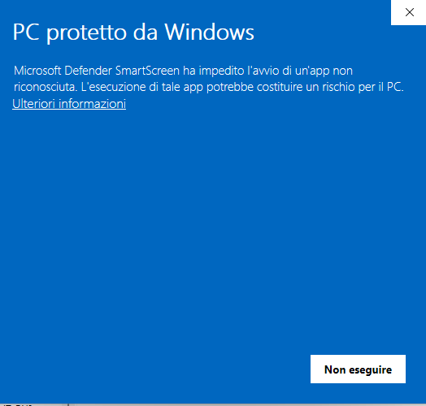
   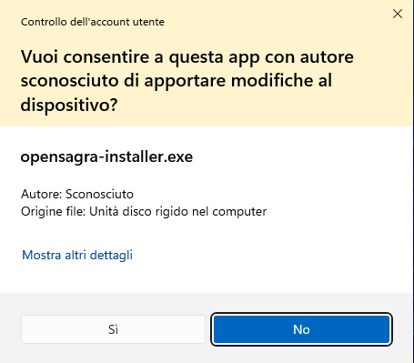
   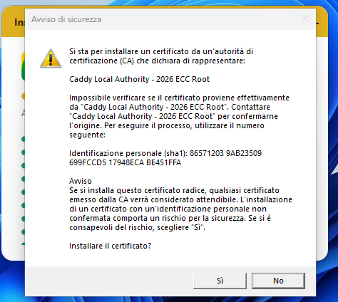
3. Da qui in poi **non c'è più nulla da fare**: una finestra mostra
   l'avanzamento mentre l'installer scarica e configura da solo tutto il resto
   (FrankenPHP, MariaDB, il database, il certificato, il firewall). Ci vogliono
   alcuni minuti, dipende dalla connessione internet.

   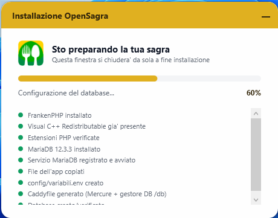
4. A fine installazione l'app è già pronta e raggiungibile su questo PC.

### Il pannello di controllo

Da questo momento, ogni volta che il PC è acceso, trovi una piccola finestra
che mostra lo stato del server:

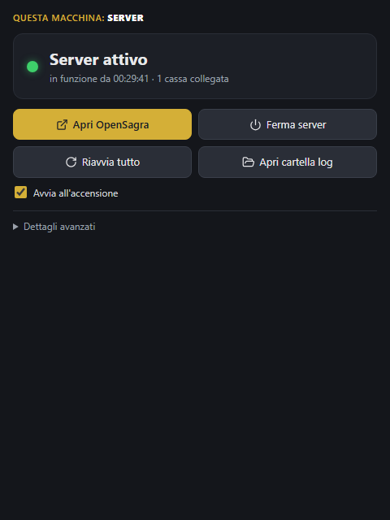

Nell'uso di tutti i giorni conta solo questo:

- **↗ Apri OpenSagra** è il pulsante che userai il 99% delle volte: apre l'app
  vera nel browser.
- **Avvia all'accensione**: se spuntato (di default lo è), il server riparte
  da solo ogni volta che accendi il PC — non devi ricordarti di avviare nulla
  a mano la mattina della sagra.
- **Chiudere questa finestra non ferma il server**: è solo la finestra di
  stato, il server continua a girare in background. La ritrovi cliccando
  sull'icona nella system tray di Windows (vicino all'orologio, in basso a
  destra).

Tutto il resto — **Ferma/Avvia server**, **Riavvia tutto**, **Apri cartella
log** e **Dettagli avanzati** servono solo per la diagnosi tecnica o chi vuole vedere cosa succede "dietro le quinte"; **non ti servirà nell'uso quotidiano**.:

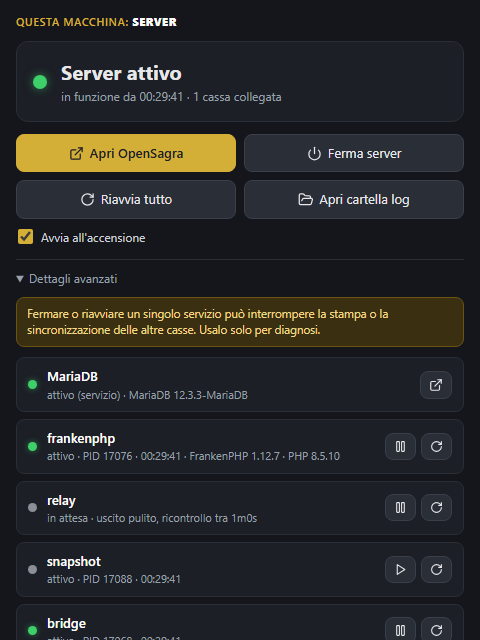

### 1.1 La connessione è sempre protetta (HTTPS)

OpenSagra gira di default sempre con la connessione protetta (il lucchetto accanto
all'indirizzo nel browser), con questi vantaggi concreti sul campo:

- **Connessione più stabile su WiFi da sagra** — meno probabilità di
  "singhiozzi" quando la rete è affollata (tante casse/tablet insieme).
- **Nessun avviso "sito non sicuro"** che potrebbe confondere chi lavora al
  banco.
- **Compatibilità sistemi mobile** e con altre funzionalità
  moderne dei browser/tablet più recenti: per i tablet e telefoni è necessario installare a mano il certificato HTTPS generato dall'installer. Nulla di complicato, ma è un passaggio aggiuntivo rispetto ai PC — vedi qui sotto.

### 1.2 Collegare un tablet o telefono

Sulla pagina **Configurazione Rete** trovi un **QR code**, sotto "Collega un
cellulare o tablet":

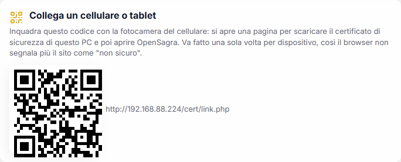

1. Inquadralo con la fotocamera del cellulare/tablet che vuoi usare come
   cassa — si apre una pagina dedicata ("Collega questo dispositivo").
2. Tocca **"Scarica certificato"**. È il "biglietto da visita" di questo PC:
   una volta installato, il browser smette di segnalare OpenSagra come sito
   non sicuro. Va fatto **una sola volta per dispositivo**.
3. Installa il file scaricato — la pagina stessa spiega come, a seconda del
   dispositivo:
   - **Android**: Impostazioni → Sicurezza e privacy → Crittografia e
     credenziali → Installa certificato → Certificato CA → scegli il file
     appena scaricato. Dopo l'installazione Android mostra un avviso
     permanente ("rete monitorata" o simile): è normale, non un errore.
   - **iPhone/iPad**: dopo il download, apri Impostazioni → in alto comparirà
     "Profilo scaricato" → Installa. Poi vai in Impostazioni → Generali →
     Informazioni → Impostazioni certificati attendibili e attiva la piena
     fiducia per il certificato OpenSagra.
   - **Firefox** (telefono o PC): usa un proprio elenco di certificati,
     separato da quello del sistema — la prima volta mostrerà comunque un
     avviso ("Avanzate" → "Accetta il rischio e continua"). È normale, dopo
     funziona senza più avvisi.
4. Torna sulla pagina e tocca **"Apri OpenSagra"**: il lucchetto conferma che
   il dispositivo ora si fida di questo PC.

Se preferisci saltare questo passaggio, la stessa pagina offre anche "Apri
OpenSagra senza HTTPS" — funziona comunque, semplicemente senza il lucchetto.

---

## 2. Primo avvio: l'ID di questa cassa

La primissima volta che apri l'app **su un dispositivo/browser nuovo**, prima
ancora di vedere la Home, ti viene chiesto un nome per questa postazione:

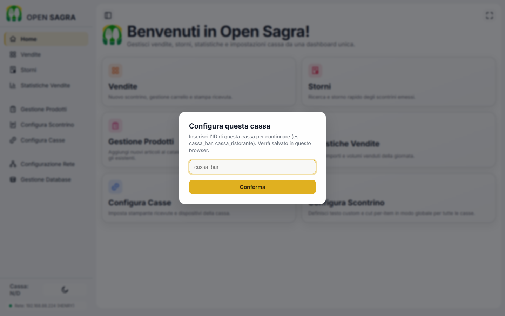

Scrivi un nome a piacere che ti aiuti a riconoscerla (es. `cassa_bar`,
`cassa_griglia`, `cassa_dolci`) e premi **Conferma**. Da quel momento vedrai
sempre quel nome in basso a sinistra nel menu, su ogni pagina:

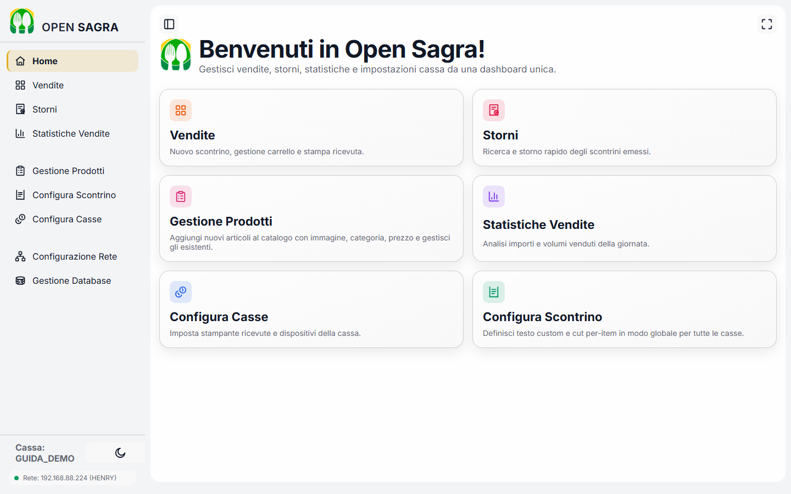

**Cosa significa in pratica**: questo nome viene salvato **solo in questo
browser, su questo dispositivo** — non ti verrà richiesto di nuovo finché non
lo cancelli tu. Ogni tablet/PC che usi come cassa ha il proprio nome
indipendente, anche se tutti vedono lo stesso catalogo prodotti (specialmente
se configurati come "Client", vedi §3): è così che l'app distingue le vendite
fatte a un banco da quelle fatte a un altro, e a quale stampante mandare gli
scontrini di ciascuna cassa (vedi §6).

**Se hai bisogno di cambiarlo** (es. hai riutilizzato lo stesso tablet per
un'altra postazione, o hai sbagliato a scriverlo la prima volta): basta cancellare i
**cookie/dati del sito** di quel browser per questo indirizzo — su Chrome/Edge,
tocca l'icona del lucchetto (o delle informazioni sul sito) accanto
all'indirizzo → "Impostazioni sito"/"Autorizzazioni sito" → **Cancella dati** —
e ricaricare la pagina: il modal ricompare, pronto per un nuovo nome. Non
cancella nessuna vendita o prodotto: quei dati vivono sul database, non nel
browser.

---

## 3. La modalità Indipendente

Appena installato, **ogni PC funziona da solo**: gestisce il proprio catalogo
prodotti, le proprie vendite, il proprio magazzino. Questa si chiama modalità
**Indipendente**, ed è quella attiva di default su ogni installazione — non
c'è nulla da configurare per usarla, funziona già così appena apri l'app.

Va benissimo per una sagra con **una sola cassa**. Se invece hai **più casse**
che vogliono vedere lo stesso magazzino e le stesse vendite in tempo reale, una delle
installazioni farà da "centrale" e le altre si collegheranno ad essa. Questo
si decide dalla pagina **Configurazione Rete**, in qualsiasi momento — non è
una scelta da fare per forza durante l'installazione, e si può cambiare
quando vuoi:

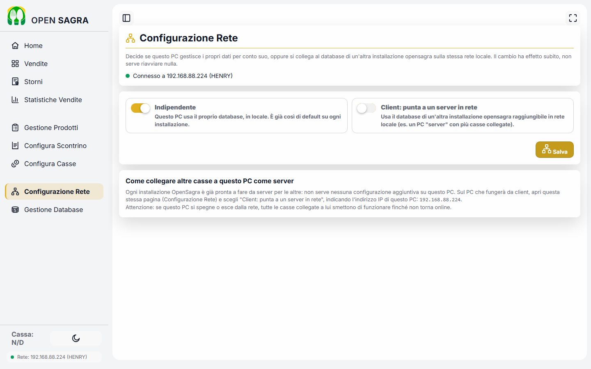

- **Indipendente** (attivo di default): questo PC usa il proprio database, in
  locale. Ogni installazione parte così.
- **Client: punta a una cassa centrale in rete**: questa cassa smette di usare il
  proprio catalogo e usa quello di un'altra installazione OpenSagra
  raggiungibile sulla stessa rete WiFi/cavo (es. il PC dietro al banco
  principale). Basta indicare il suo indirizzo di rete (es.
  `192.168.1.10`) — te lo indica la pagina stessa dell'altro PC, sotto "Come
  collegare altre casse a questo PC come server".

**Il cambio ha effetto subito**: non serve riavviare niente, né su questo PC
né sull'altro.

**Da tenere a mente**: se il PC "centrale" si spegne o perde la connessione
mentre altre casse sono collegate a lui in modalità Client, quelle casse **non
smettono di funzionare** — dopo una breve attesa (nel caso peggiore una
trentina di secondi, spesso meno) passano da sole a lavorare in locale, senza
alcuna vendita persa. È un caso raro e gestito automaticamente: il paragrafo
successivo spiega esattamente cosa vede l'operatore se succede, in parole
semplici.

### 3.1 La modalità Client: cosa succede se il server centrale sparisce

Quando una cassa è in modalità **Client** e tutto funziona normalmente, non
c'è nulla di diverso da notare: vede lo stesso catalogo e le stesse vendite di
tutte le altre casse collegate allo stesso "centrale", in tempo reale.

Il caso interessante è quando il PC centrale diventa irraggiungibile — si
spegne per sbaglio, qualcuno stacca il cavo di rete, il WiFi ha un
problema momentaneo. Ecco cosa succede, passo per passo, **senza che nessuno
debba fare nulla**:

1. **L'app ritenta da sola**, nel giro di pochi secondi, non serve
   premere "Stampa" più volte.
   Se passa più di una decina di secondi senza successo,
   automaticamente passa al passo successivo.
2. Vicino al nome della rete, nel menu laterale, compare un piccolo conto alla
   rovescia (es. *"DB locale tra 12s"*) — è solo un modo per far sapere
   all'operatore cosa sta per succedere, non un errore da preoccuparsi.
3. **Passata questa breve attesa** (nel caso peggiore una trentina di secondi,
   spesso molto meno), la cassa si scollega dalla centrale e **da sola** riprende a vendere normalmente,
   con lo stesso catalogo che aveva già in memoria della cassa centrale. **Nessuna vendita viene persa. MAI**
4. Nel caso — raro — in cui l'attesa scada esattamente mentre stai
   registrando una vendita, vedrai un messaggio "vendita NON registrata,
   riprova": il carrello **resta esattamente com'era**, quindi basta premere
   di nuovo "Stampa" pochi secondi dopo (a quel punto la cassa sta già
   lavorando in locale) — non serve rifare l'ordine da capo.

**Le vendite fatte "in autonomia" durante l'interruzione non vengono perse né
lasciate lì per sempre: restano in attesa di essere risiconizzate sulla cassa centrale,
e un avviso nella barra laterale (*"Vendite da sincronizzare"* con
un pulsante **"Sincronizza ora"**) lo ricorda finché non vengono inviate.

**Ri-sincronizzazione con la cassa centrale**: **premi sempre "Chiudi Cassa" a fine
turno/serata** (vedi §7.9). 

Chiudere la cassa manda automaticamente alla cassa centrale (se raggiungibile)
tutte le eventuali vendite rimaste in sospeso.

**Come tornare al server centrale, una volta che è di nuovo raggiungibile**:
qui **serve un'azione manuale** — Basta tornare su **Configurazione Rete** e riselezionare
"Client" con lo stesso indirizzo di prima — l'app verifica subito che il
collegamento funzioni prima di accettarlo. Un avviso ti ricorda che c'è un debito di sincronizzazione da saldare.

L'app non si ricollega da sola in
automatico, per una buona ragione: è meglio che sia una persona a confermare
che il PC centrale è davvero di nuovo pronto, non un tentativo automatico
ripetuto alla cieca. 

---

## 4. Gestione Prodotti: catalogo e magazzino

La pagina **Gestione Prodotti** (nel menu laterale) gestisce sia l'aggiunta di
nuovi articoli sia il catalogo esistente:

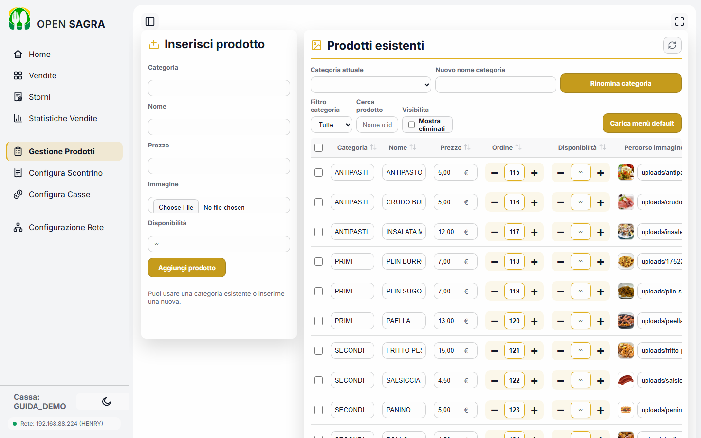

### 4.1 Aggiungere un prodotto nuovo

Nel form a sinistra: **categoria** (puoi scrivere il nome di una categoria già
esistente o crearne una nuova al volo — non serve un passo separato per
creare una categoria), **nome**, **prezzo**, una **immagine** facoltativa (si
vede sulla card del prodotto nella cassa, aiuta chi vende a riconoscerlo a
colpo d'occhio) e la **disponibilità**.

### 4.2 Disponibilità e ordine

**Disponibilità**: se non la imposti resta **infinita** (∞), il prodotto è
sempre in vendita. Impostala a un numero solo per gli articoli a scorta
limitata: scala da sola ad ogni vendita e il prodotto sparisce automaticamente
dalla cassa (§7) quando arriva a zero.

**Ordine**: decide la posizione con cui il prodotto compare nella griglia di
vendita (utile per tenere in cima i più venduti).

### 4.3 Modificare il catalogo esistente

A destra, l'elenco di tutti i prodotti. Da segnalare: **"Rinomina categoria"**
cambia il nome di una categoria su **tutti** i prodotti che la usano in un
colpo solo, senza doverli modificare uno per uno; e un prodotto **eliminato**
non sparisce dallo storico delle vendite già fatte (resta tutto tracciato
nelle statistiche, §9) — la spunta "Mostra eliminati" permette di ritrovarlo
se serve riattivarlo.

---

## 5. Configurazione Scontrino

Questa pagina imposta come appare lo scontrino stampato, **per tutte le casse
insieme** (non è una configurazione da ripetere per ognuna):

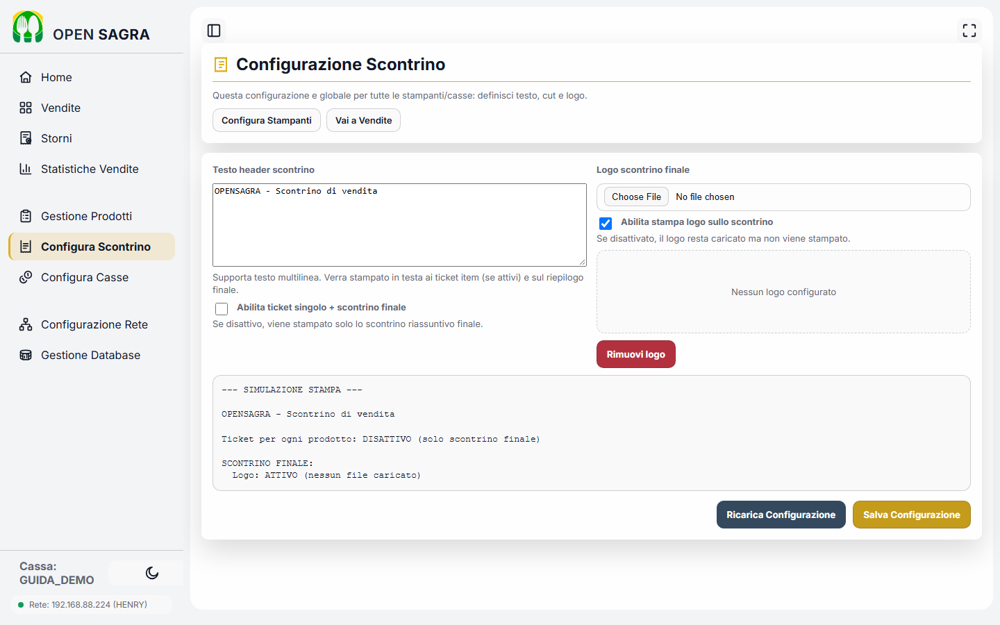

- **Testo header scontrino**: il testo che compare in cima a ogni scontrino
  (nome della sagra, un messaggio di benvenuto, ecc.) — supporta più righe.
- **Logo**: un'immagine facoltativa da stampare sullo scontrino finale — il
  logo della sagra o di uno sponsor, ad esempio (va caricata come file); la
  spunta accanto permette di tenerla caricata ma disattivata, senza doverla
  ricaricare se serve riattivarla in un secondo momento.
- **"Abilita ticket singolo + scontrino finale"**: decide se, oltre allo
  scontrino riassuntivo finale, viene stampato anche un tagliandino separato
  per ogni riga dell'ordine (vedi §6.1 per un esempio d'uso pratico).
- In basso trovi sempre un'**anteprima testuale** che mostra esattamente cosa
  verrà stampato con le impostazioni correnti, **prima** di salvare — così
  puoi controllare il risultato senza dover stampare uno scontrino di prova
  reale ogni volta.

---

## 6. Configurazione Casse e stampanti

La pagina **Configura Casse** (nel menu laterale) è dove si registra ogni
postazione di vendita e si decide come stampa i suoi scontrini:

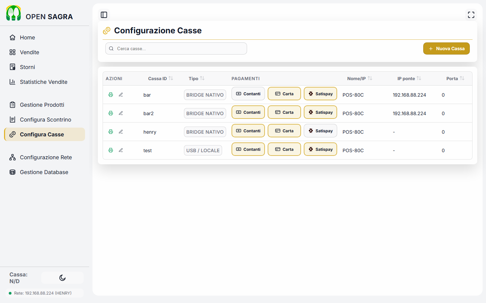

*(su schermo stretto/tablet la stessa pagina diventa un elenco a schede, una
per cassa — comodo da consultare in piedi al banco:)*

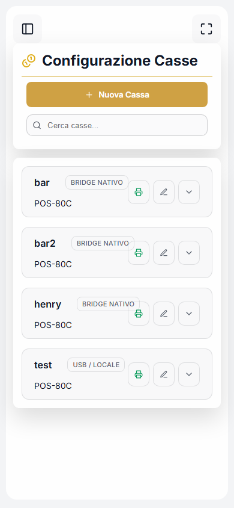

Il pulsante **"+ Nuova Cassa"** apre un modulo con: l'**ID della cassa** (lo
stesso nome scelto al primo avvio, §2 — dev'essere identico, è così che
OpenSagra abbina la configurazione alla postazione giusta), il **tipo di
stampante**, i **metodi di pagamento** accettati da quella postazione
(Contanti/Carta/Satispay) e il **fondo cassa** di partenza (l'importo in
contanti presente all'apertura, usato per il riepilogo di fine turno, §7.9).

### Quale tipo di stampante scegliere

| Scenario | Tipo da scegliere | Note |
|---|---|---|
| Stampante **di rete** (ha un suo IP, via cavo o WiFi integrato) | **RETE** | Inserisci l'indirizzo IP della stampante. Nessun altro requisito. |
| Stampante **USB collegata allo stesso PC/tablet** che stampa (cassa indipendente tipica) | **USB / STAMPANTE LOCALE** | Il caso più comune: una cassa, una stampante, collegate allo stesso dispositivo. |
| Stampante **USB collegata a un PC, ma un'altra postazione deve stamparci sopra** (es. più tablet che condividono un'unica stampante in cucina) | **BRIDGE NATIVO** | Vedi il paragrafo dedicato subito sotto — è il caso più utile da capire bene. |
| Stampante **Bluetooth** (appaiata al tablet Android) | **BLUETOOTH** | Vedi il paragrafo dedicato più sotto. |

### 6.1 Il "Bridge nativo": stampare da lontano, su una stampante che da sola non è raggiungibile in rete

Molte stampanti termiche da banco **hanno solo la porta USB**: nessun WiFi,
nessun cavo di rete proprio. Normalmente questo le legherebbe a un solo PC,
quello a cui sono fisicamente attaccate — ma non è detto che quel PC sia lo
stesso da cui un cassiere sta vendendo.

Il **Bridge nativo** risolve esattamente questo: OpenSagra può fare da "ponte" sul PC collegato alla stampante — non
serve che quel PC abbia un monitor o che qualcuno lo usi, basta che sia acceso
— e **qualsiasi altra cassa della rete** può mandargli scontrini da stampare,
come se la stampante fosse collegata direttamente a lei. Due casi tipici in
una sagra vera:

- **Una cassa "leggera" senza stampante propria** (un tablet, un PC preso in
  prestito, una postazione temporanea) può comunque stampare scontrini reali,
  appoggiandosi alla stampante USB collegata a un altro PC in un'altra parte
  della sagra.
- **Mandare le comande dritte in cucina, senza bisogno di uno schermo in
  cucina**: la stampante resta collegata via USB a un piccolo PC (anche un
  Raspberry Pi). I cuochi vedono solo gli scontrini che escono dalla stampante, uno per ogni ordine registrato alle
  casse davanti.

Si configura dalla postazione mobile scegliendo **BRIDGE NATIVO** come metodo di stampa e
l'**indirizzo IP del PC-ponte**:

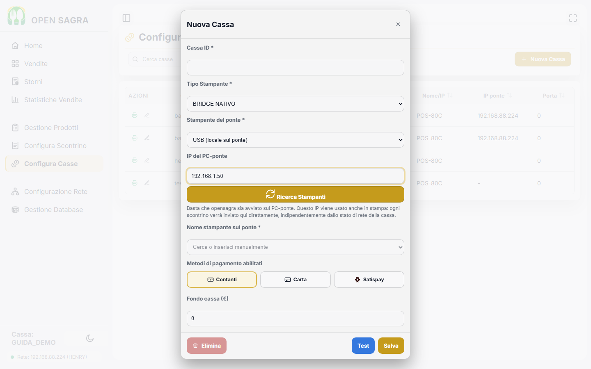

Il pulsante **"Ricerca Stampanti"** interroga direttamente il PC-ponte e
propone l'elenco delle stampanti che vede, così normalmente non serve
scriverne il nome a mano — basta che OpenSagra sia avviato anche lì.

In pratica: si collega la stampante fisica al PC-ponte, e OpenSagra
riceve le comande da tutte le casse che la usano.

#### Scenario di esempio avanzato: servizio al tavolo con cassa collegata alla cucina

Il modello OpenSagra è: *il cliente ordina alla cassa →
paga → riceve lo scontrino → lo scambia con il cibo allo stand*.
Puoi eventualmente offrire l'ordine direttamente al tavolo in forma semplice
usando il **Bridge nativo** con la stampante fisica **in cucina**:

- il cameriere prende l'ordine dal tablet come una cassa qualunque e fa
  pagare;
- lo scontrino esce **direttamente in cucina** ;
- la cucina prepara leggendo lo scontrino; il cameriere torna a ritirare.

Con "ticket singolo + scontrino finale" attivo (§5) puoi scegliere se
stampare **un unico scontrino riassuntivo** (comodo per ordini piccoli) oppure
**un tagliandino separato per ogni riga** (comodo per ordini grossi, così il
tavolo consegna al cameriere i tagliandini man mano). È una comanda "sola
andata": la cucina non ha modo di segnalare ritardi o esauriti al cameriere se
non a voce — per una sagra va bene, per un servizio più complesso servirebbe
altro.

### 6.2 Bluetooth (tablet e telefoni)

Se usi un **tablet o telefono Android** come cassa con una stampante termica
**Bluetooth** (senza cavi, appaiata direttamente al dispositivo), serve
installare una app gratuita di supporto, **RawBT**, dal Play Store, e
appaiare la stampante nelle impostazioni Bluetooth di Android come faresti
con delle cuffie. Da quel momento, scegliendo il tipo **Bluetooth** su questa
cassa, ogni scontrino stampato viene mandato automaticamente all'app, che lo
inoltra alla stampante appaiato.

---

## 7. La pagina di vendita (Vendite)

È la pagina che si usa per tutto il servizio: aggiungere prodotti al
carrello, applicare sconti, incassare, stampare lo scontrino. Ecco come si
presenta con qualche prodotto nel carrello:

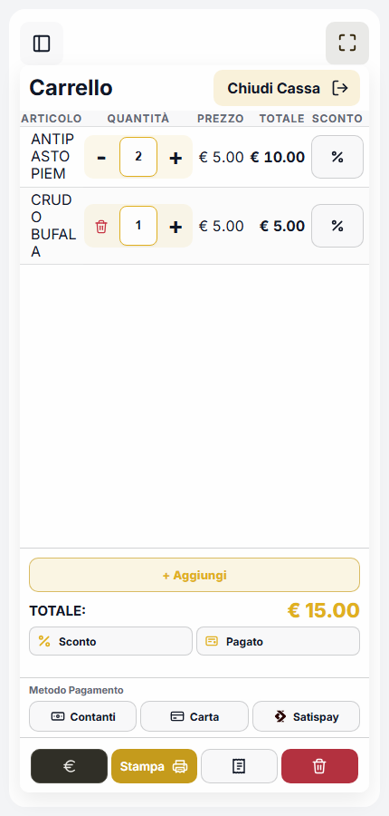

### 7.1 Aggiungere prodotti al carrello

Il catalogo prodotti è diviso per categorie (Antipasti, Primi, Secondi, …).
**Basta toccare/cliccare la card di un prodotto per aggiungerlo al
carrello** con quantità 1. Se lo tocchi di nuovo, la quantità sale di 1 (non
crea una seconda riga).

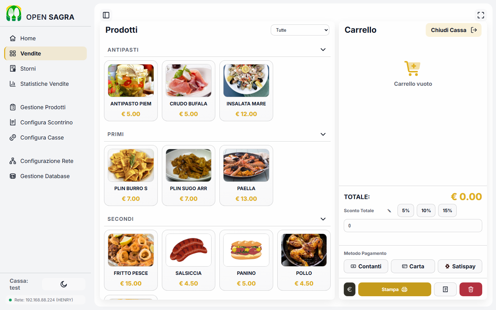

Su schermi stretti (tablet/telefono) il catalogo si apre a schermo intero col
bottone **"+ Aggiungi"**; su schermi larghi è già visibile accanto al
carrello.

Nel carrello, ogni riga ha i pulsanti **− / +** per cambiare la quantità di
un'unità alla volta (tenerli premuti la fa scorrere più veloce), oppure puoi
scrivere direttamente il numero nella casella della quantità. Il cestino 🗑
sulla prima unità rimuove la riga.

Se un prodotto ha una scorta limitata e configurata (magazzino, §4.2), l'app
non ti lascia superare la quantità disponibile e avvisa quando un prodotto è
esaurito.

**Il carrello si salva da solo**: se ricarichi la pagina per sbaglio o il
browser si chiude, lo ritrovi come l'avevi lasciato (finché non completi la
vendita o lo svuoti col cestino in alto).

### 7.2 Sconto su una singola riga

Ogni riga del carrello ha un pulsante **%** a destra: apre un piccolo
pannello con degli sconti veloci in percentuale (tre valori predefiniti,
modificabili con la matita ✎ nel pannello dello sconto totale — vedi sotto),
più **100%** (riga gratis), **Personale** (per inserire una percentuale a
piacere) e **Azzera** (toglie lo sconto dalla riga):

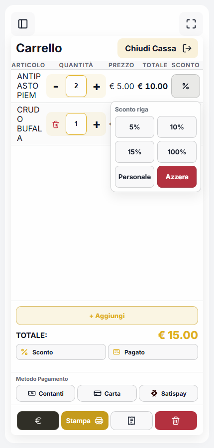

Lo sconto riga si applica **solo a quella riga**, indipendentemente dallo
sconto totale sotto.

### 7.3 Sconto sul totale

Il bottone **"% Sconto"** sotto il totale apre un pannello con tre
percentuali rapide (modificabili con la matita ✎) più una casella dove
scrivere un importo in **euro** a piacere. Lo sconto totale si somma allo
sconto già applicato riga per riga: il totale finale tiene conto di
entrambi.

### 7.4 Metodo di pagamento

Sotto compaiono i metodi abilitati per questa cassa (**Contanti**, **Carta**,
**Satispay**) — quali sono attivi si decide da **Configura Casse** (§6).
Basta scegliere quello usato dal cliente prima di registrare la vendita.

### 7.5 Calcolare il resto (pagamento in contanti)

Il bottone **"Pagato"** apre un pannello con dei tagli rapidi (5€, 10€, 20€,
50€, 100€, 200€, 500€): **ogni bottone premuto si somma a quelli premuti
prima**, non lo sostituisce. Se il cliente paga con un 20€ e un 5€, tocchi
prima "20€" poi "5€" e l'importo pagato diventa 25€ da solo:

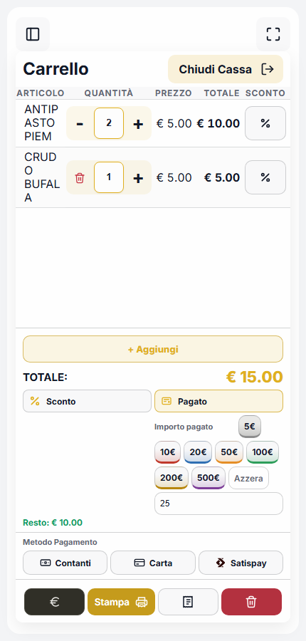

- Puoi anche scrivere l'importo esatto a mano nella casella sotto ai
  bottoni (utile se il cliente paga con una banconota "strana" o un taglio
  non presente tra i rapidi) — scrivere nella casella e toccare i bottoni si
  può anche mescolare, il totale del pagato è sempre la somma di tutto.
- Il bottone **"Azzera"** riporta l'importo pagato a zero, per ricominciare.
- Sotto compare subito **"Resto: € ..."** in verde se l'importo pagato copre
  il totale, oppure **"Importo insufficiente"** in rosso se manca ancora
  qualcosa.

Con pagamento **Carta** o **Satispay** questo pannello non serve (l'importo
pagato coincide sempre col totale).

### 7.6 Registrare la vendita e stampare

Il bottone dorato **"Stampa"** in basso registra la vendita e manda lo
scontrino alla stampante configurata per questa cassa (§6). Se per qualsiasi
motivo la stampa non riesce (stampante spenta, scollegata, ponte di stampa
irraggiungibile...) **la vendita resta comunque registrata** — un avviso
te lo segnala e potrai ristamparla dallo storico ordini (sotto), non c'è
mai il rischio di "vendita persa" per un problema di stampa.

Se il server non risponde per un attimo (rete instabile), l'app riprova da
sola per qualche secondo prima di mostrare un avviso — non serve premere
"Stampa" più volte: un doppio invio della stessa vendita non crea mai due
righe duplicate. Se la cassa è in modalità Client e il centrale resta
irraggiungibile più a lungo, vedi §3.1 per cosa succede esattamente.

### 7.7 Storico ordini: ristampa e storno rapido

Il bottone con l'icona a scontrino, in alto nella colonna del carrello, apre
l'elenco degli **ordini recenti** di questa cassa: da lì puoi aprire il
dettaglio di una vendita già fatta, **ristampare** lo scontrino (utile se
si è inceppata la carta o la comanda non è arrivata in cucina), oppure
**stornarla** se serve annullarla.

### 7.8 Apertura cassetto

Se la cassa ha un cassetto portamonete collegato alla stampante, il bottone
dedicato lo apre elettricamente (senza bisogno di stampare uno scontrino).

### 7.9 Chiudere la cassa a fine turno/serata

Il bottone **"Chiudi Cassa"** (in alto, sopra il carrello) chiude la
giornata per questa postazione: registra l'orario e mostra un riepilogo —
fondo cassa iniziale, totale contanti incassati, totale atteso in cassa —
utile per il conteggio a fine serata. Da lì si può anche saltare
direttamente alle statistiche vendite.

**Fallo sempre, ad ogni fine turno**: oltre al riepilogo contabile, è anche il
momento in cui vengono inviate al server centrale eventuali vendite fatte "in
autonomia" durante una breve interruzione di rete (§3.1) — così non resta mai
nulla in sospeso da un turno all'altro.

---

## 8. Storni

Oltre allo storno rapido di un singolo ordine dallo storico della cassa
(§7.7), la pagina **Storni** (nel menu laterale) permette di annullare uno o
più scontrini insieme, indicandone i numeri (es. `101, 102, 103`) e, se
serve, la data — utile per correzioni fatte a fine giornata o su più
scontrini insieme, invece che uno alla volta dalla cassa. Dalla stessa
pagina si può anche consultare l'elenco degli scontrini già stornati,
filtrando per data e per cassa.

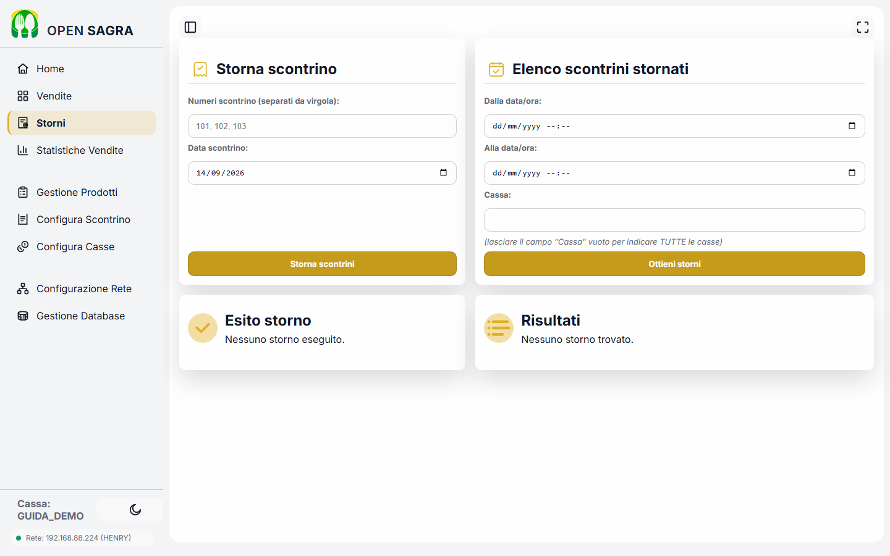

---

## 9. Statistiche Vendite

La pagina **Statistiche Vendite** (nel menu laterale) riassume l'andamento
del servizio, con la stessa vista sia che tu abbia una cassa sola sia più
casse collegate insieme:

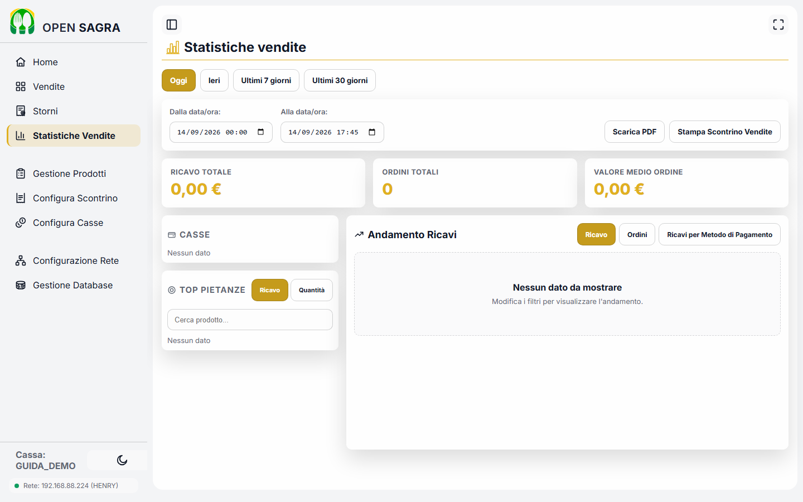

- I pulsanti in alto (**Oggi / Ieri / Ultimi 7 giorni / Ultimi 30 giorni**)
  filtrano velocemente il periodo; le due caselle data/ora accanto permettono
  un intervallo scelto a piacere.
- Tre numeri di riepilogo sempre in vista: **ricavo totale**, **ordini
  totali**, **valore medio per ordine**.
- **Casse**: il contributo di ciascuna postazione al totale — utile con più
  casse collegate per vedere quale banco ha venduto di più.
- **Top pietanze**: la classifica dei prodotti più venduti nel periodo
  scelto, per ricavo o per quantità (i due pulsanti in alto alla card) — con
  una casella di ricerca se il catalogo è lungo.
- **Andamento Ricavi**: un grafico nel tempo, spostabile su Ricavo, Ordini o
  Ricavi per metodo di pagamento (per vedere ad esempio quanto è stato
  incassato in contanti rispetto a carta/Satispay).
- **Scarica PDF** produce un report scaricabile su questo dispositivo;
  **Stampa Scontrino Vendite** manda lo stesso riepilogo direttamente alla
  stampante di questa cassa — comodo per un resoconto cartaceo a fine serata
  senza dover collegare un computer.

---

## 10. Cosa manca ancora in questa guida

Restano da scrivere, in un prossimo aggiornamento:

- Aggiornare un'installazione esistente e disinstallarla.
- Casi d'errore più comuni e come risolverli (stampante non raggiungibile,
  rete assente, ecc.).
